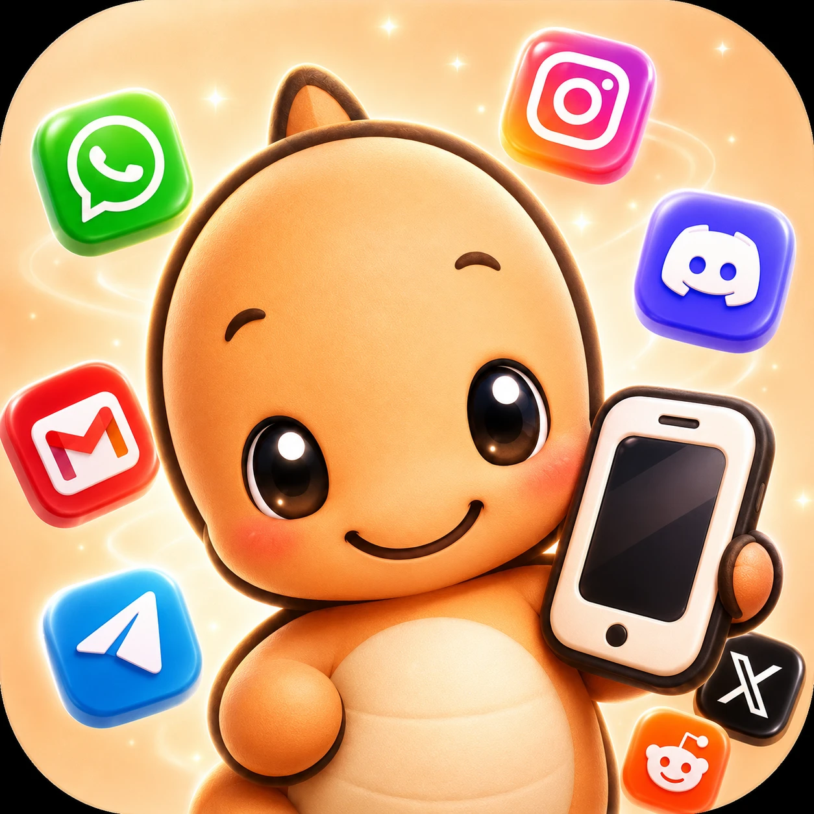
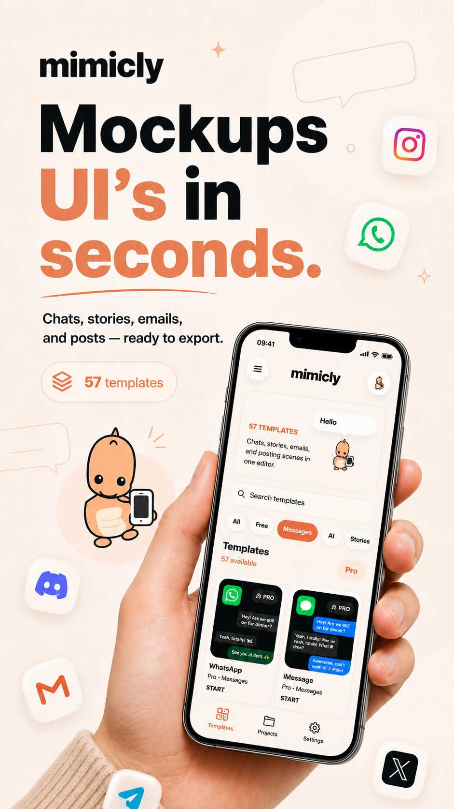
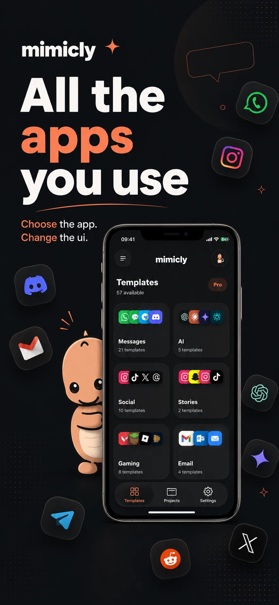
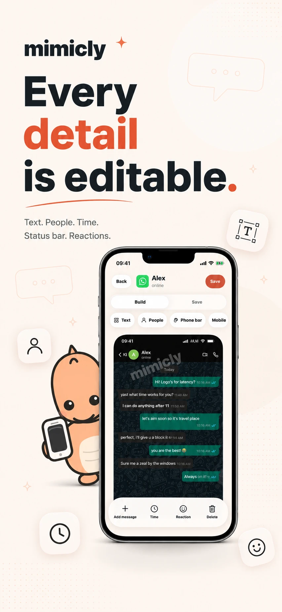
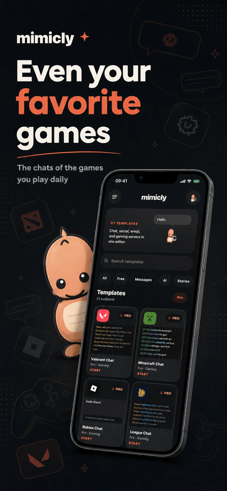

# Red Person

**Indie developer shipping consumer apps.**

I design, build, and launch iOS and web products end to end — from first sketch to the App Store.

---

## Featured — Mimicly: Chat & UI Editor

> **Realistic UI mockups in seconds.** Recreate the chats, stories, emails, and posts of the apps you use every day — every detail editable, export-ready. Live on the App Store.

  <a href="https://mimicly.net"><b>mimicly.net</b></a>
  &nbsp;·&nbsp;
  <a href="https://apps.apple.com/tr/app/mimicly-mockup-ui/id6777584708"><b>Download on the App Store</b></a>

  
  
  
  

**What it does**

- 50+ pixel-accurate templates — WhatsApp, iMessage, Discord, Instagram, X, Gmail, game chats, and more
- Everything is editable: text, people, timestamps, reactions, even the status bar
- Clean, share-ready exports in seconds

---

## Stack

`Next.js` · `React Native / Expo` · `TypeScript` · `Swift`

---

Building in public, one app at a time.

<a href="https://mimicly.net">mimicly.net</a>

