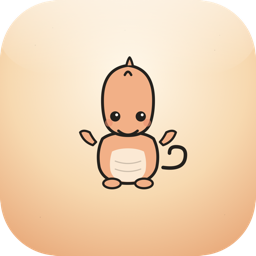

  

# Mimicly

### Troll your friends with fake UI's

  
  
  

Build polished chat, social, AI, email, and gaming mockups with editable details and clean exports.

**[Open Mimicly](https://mimicly.net)** · **[Launch Editor](https://mimicly.net/editor)** · **[Go Pro](https://mimicly.net/pricing)**

 

